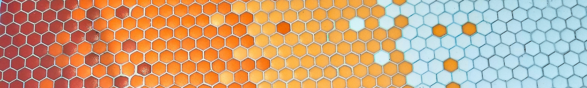

```{r setup, include=FALSE}
library(connectwidgets)
library(dplyr)

knitr::opts_chunk$set(echo = FALSE, message = FALSE, warning = FALSE)

client <- connect(
  server  = Sys.getenv("CONNECT_SERVER"),
  api_key = Sys.getenv("CONNECT_API_KEY")
  )

all_content <- client %>%
  content()

# sample_content <- all_content %>%
#   arrange(desc(updated_time)) %>%
#   slice_head(n = 50)

marketing_content <- all_content %>%
  filter(owner_username == "isabella.velasquez") %>% 
  mutate(owner_username = "rstudio")
```


<sup>Photo by <a href="https://unsplash.com/@gpthree?utm_source=unsplash&utm_medium=referral&utm_content=creditCopyText">George Pagan III</a> on <a href="https://unsplash.com/s/photos/hexagons?utm_source=unsplash&utm_medium=referral&utm_content=creditCopyText">Unsplash</a></sup>

## RStudio Connect: The One-Stop Shop For All Your Data Products

With RStudio Connect, you can publish your data science projects and deliver a great experience to your audience.

Let's explore various different projects hosted on Connect:

### <font size="8">Shiny Apps</font>

<a href="https://shiny.rstudio.com/" target = "_blank">Shiny</a> is an R package that makes it easy for data scientists to build interactive web apps straight from R, without having to learn any new languages or frameworks. You can securely publish, host, and share Shiny applications with RStudio Connect. Learn more in our <a href="https://www.rstudio.com/blog/sharing-shiny-apps-on-rstudio-connect/" target = "_blank">blog post</a>.

Check out some example Shiny apps hosted on our Connect server below.

```{r grid-shiny}
marketing_content %>%
  filter(app_mode == "shiny") %>% 
  rsc_grid()
```

### <font size="8">Python Content</font>

In addition to R content, RStudio Connect also publishes Python content like Jupyter notebooks, Flask applications, FASTAPI applications, and more.

* In the example below, Daniel Petzold created a Jupyter Notebook in RStudio Workbench before deploying to Connect. Watch Daniel’s full walkthrough on <a href="https://www.youtube.com/watch?v=x8Wf8qXAGDI&feature=youtu.be" target = "_blank">YouTube</a>.
* Read the associated <a href="https://www.rstudio.com/blog/build-and-share-jupyter-notebooks-on-rstudio-team/" target = "_blank">blog post</a>.
* Find out more about integrating <a href="https://docs.rstudio.com/rsc/integration/python/" target = "_blank">RStudio Connect and Python</a>.

```{r card}
marketing_content %>%
  filter(name == "space_tracker-1643750295237") %>% 
  rsc_card()
```

### <font size="8">xaringan Slides</font>

The xaringan package allows you to create beautiful slide decks using R Markdown. RStudio Connect allows you to do so directly from your RStudio console.

These slides showcase examples of the <a href="https://evamaerey.github.io/flipbookr/" target = "_blank">flipbookr</a> package as detailed in <a href="https://www.rstudio.com/blog/building-code-movies-with-flipbookr/" target = "_blank">this blog post</a>.

```{r grid-xaringan}
marketing_content %>%
  filter(name %in% c("magick", "idaho_mapping", "an_mtcars_flipbook_embed", "aus_tmap1")) %>% 
  arrange(title) %>% 
  rsc_grid()
```

### <font size="8">APIs, Pinned Data and Models</font>

The <a href="https://rstudio.github.io/plumbertableau/" target = "_blank">plumbertableau</a> package allows you to integrate dynamic R and Python models in Tableau. The items below are used in our <a href="https://www.rstudio.com/blog/dynamic-r-and-python-models-in-tableau-using-plumbertableau/" target = "_blank">walkthrough</a> of this package.

* The <a href="pins.rstudio.com/" target = "_blank">pins</a> data allows you to 'pin' objects like data or models to your RStudio Connect server for easy access in your data pipeline. Learn more in our <a href="https://www.rstudio.com/blog/sharing-data-with-the-pins-package/" target = "_blank">blog post</a>.
* The <a href="https://www.rplumber.io/" target = "_blank">plumber</a> package allows you to create APIs from your R functions with a few annotations. RStudio Connect can then host the APIs for fast and secure use. 

```{r table-plumbertableau}
marketing_content %>%
  filter(stringr::str_detect(name, "seattle_parking")) %>% 
  rsc_table()
```
